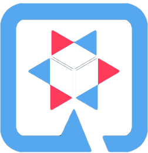
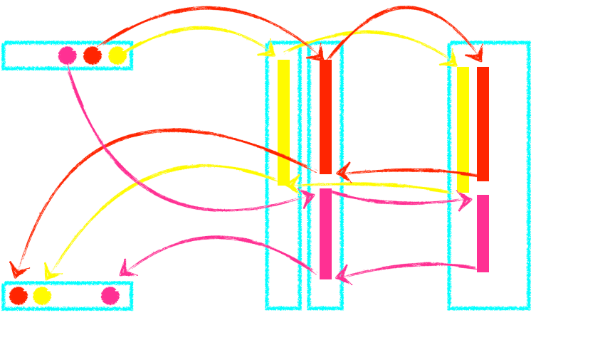
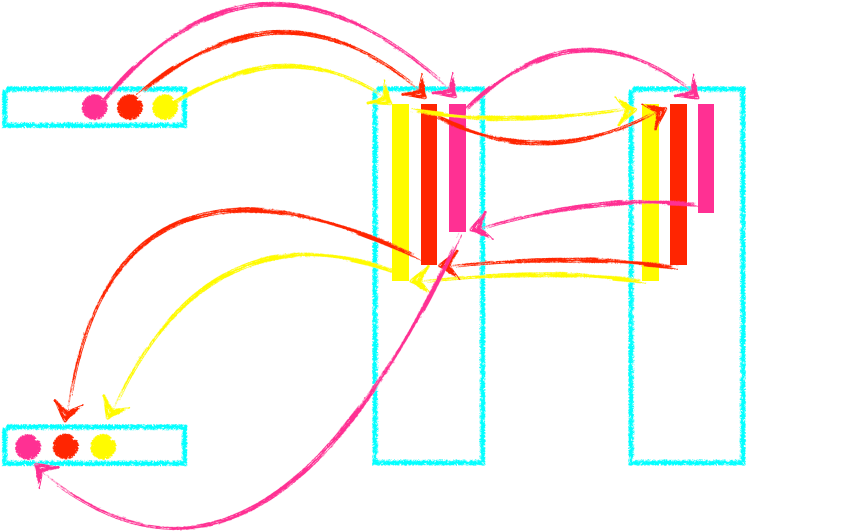
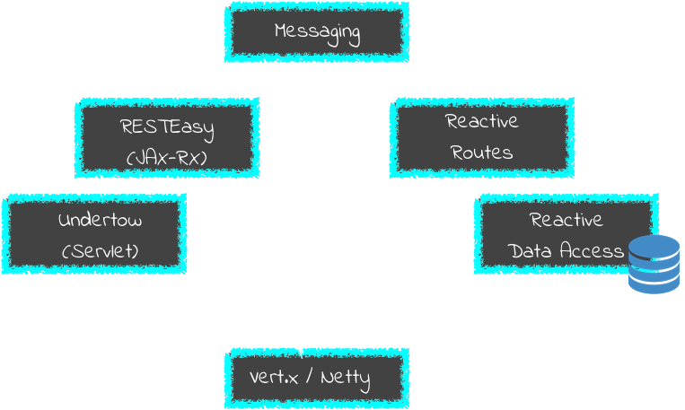
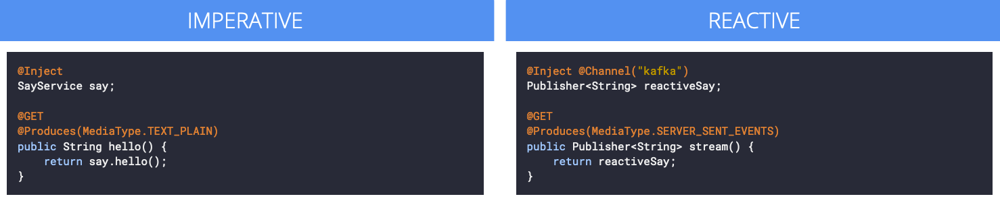

## Quarkus

> C'est quoi ?

-@-

### Quarkus

* Compilation native
* serveur *Non-blocking IO*
* "Unifie" impératif et réactif
* des **standards**
* des bonnes idées

-@-

## Compilation native

-@@-

> on garde ça pour plus tard<!-- .element class="fragment" -->

-@-

## Serveur

## Non blocking IO

-@@-

### Non blocking IO ????

-@@-

#### Serveur "standard"

*Tomcat, Thorntail, Undertow...*

-@@-

#### Serveur non blocking IO

 <!-- .element style="max-width: 80%;" -->

***Vert.X***

-@@-

### Quarkus & Vert.X

-@-

### Imperative & reactive ?

Les deux type de développement d'API disponible

-@@-

### Imperative & reactive ?

> possible dans la même classe !<!-- .element class="fragment" -->