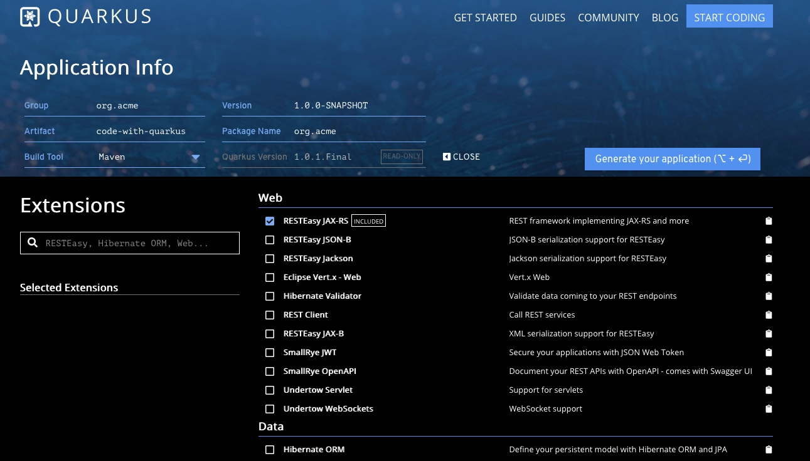
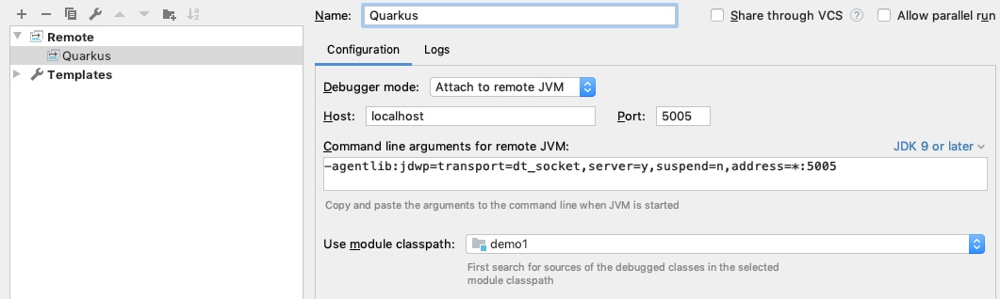

***C'est beau tout ça...***

***Mais on joue quand ?***

-@@-

### Quarkus : premier projet

-@@-

### Créer un projet

* Maven *via le plugin maven*<!-- .element class="fragment" -->
* code.quarkus.io *un starter !*<!-- .element class="fragment" -->

-@@-

### Maven

```maven
mvn io.quarkus:quarkus-maven-plugin:create
```

ou

```maven
mvn io.quarkus:quarkus-maven-plugin:1.0.1.Final:create \
    -DprojectGroupId=org.acme \
    -DprojectArtifactId=getting-started \
    -DclassName="org.acme.quickstart.GreetingResource" \
    -Dpath="/hello"
```

-@@-

### code.quarkus.io

La bonne idée de *Spring Initializr*

à la sauce quarkus

-@@-

### code.quarkus.io



-@@-

### Executer l'application

```shell
java \
    -cp target/lib \
    -jar target/getting-started-1.0-SNAPSHOT-runner.jar
```

> Faut relancer l'application à chaque modification ?<!-- .element class="fragment" -->

-@@-

### Le mode DEV

<!-- .element style="max-width:60%" -->

-@@-

### Le mode DEV

```shell
mvn quarkus:dev
```

-@@-

### Le mode DEV debug

```
mvn compile quarkus:dev -Ddebug
```

> ne lance l'appli que lorsqu'un debugger est connecté

-@@-

### Le mode DEV debug



connection en remote
