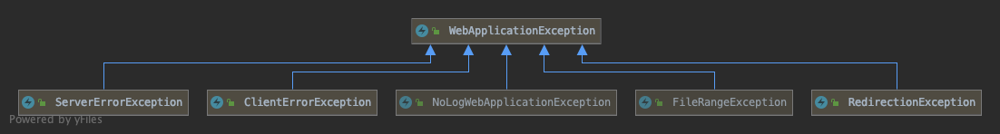

### JAX-RS

***Ou comment exposer une API REST***

**JSR 370 (v2.1)**<!-- .element style="color: #e57125; float: right; font-size: 80%" -->

-@@-

Exposition d'une API via les annotations :

```java
@GET
@PUT
@POST
@DELETE
```
> etc...

-@@-

RestEASY et `JSON`

Ajout d'une librairie

```shell
mvn quarkus:add-extensions -Dextension=quarkus-resteasy-jsonb
```

*Jackson est disponible aussi*<!-- .element class="fragment" -->

-@@-

### Les exceptions JAXRS



Permet de propager de manière *opinionated* les erreurs