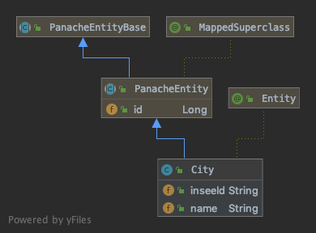
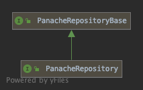

### JPA & Hibernate

**JSR 338**<!-- .element style="color: #e57125; float: right; font-size: 80%" -->

-@@-

### Hibernate

> Implementation JPA

-@@-

### Hibernate

La configuration...

... via application.properties

notes:

-@@-

### Hibernate

La configuration...

... via application.properties

```
quarkus.datasource.url=jdbc:postgresql://localhost:5432/postgres
quarkus.datasource.driver=org.postgresql.Driver
quarkus.datasource.username=postgres
quarkus.datasource.password=postgres
```

notes:
Il n'y a pas de META-INF/persistence.xml, quarkus en analysant le fichier de properties identifie le(s) connexion DB
Mais pour des besoins avancés, il est possible de mettre en place ce fichier

-@@-

### Hibernate

*2 pattern possible*

* approche DAO (Repository)<!-- .element class="fragment" -->
* Approche Active record (H7E with panache)<!-- .element class="fragment" -->

-@@-

### Hibernate / DAO

* entité
* DAO/repository (accès aux données)
* service (traitement métier)
* exposition

-@@-

### Hibernate avec Panache

> Là cela commence a devenir fun :)

**Les bonnes idées de Play**

**Et active record**

-@@-

### Hibernate avec Panache

```shell
mvn quarkus:add-extension 
  -Dextensions=quarkus-hibernate-orm-panache
```

```xml
<dependency>
    <groupId>io.quarkus</groupId>
    <artifactId>quarkus-hibernate-orm-panache</artifactId>
</dependency>
```

-@@-

### Active record

En génie logiciel, le patron de conception (design pattern) active record (enregistrement actif en français) est une approche pour lire les données d'une base de données. Les attributs d'une table ou d'une vue sont encapsulés dans une classe. Ainsi l'objet, instance de la classe, est lié à un tuple de la base. Après l'instanciation d'un objet, un nouveau tuple est ajouté à la base au moment de l'enregistrement. Chaque objet récupère ses données depuis la base ; quand un objet est mis à jour, le tuple auquel il est lié l'est aussi. La classe implémente des accesseurs pour chaque attribut. <!-- .element style="font-size: 60%;" -->

*- Wikipedia*<!-- .element style="color: #e57125; float: right" -->

-@@-

### Active record

### TL;DR

-@@-

### Active record

**L'entité porte les méthodes pour la manipuler**

-@@-

### Hibernate with *Panache*

Les entité herite de `PanacheEntity`

```java
@Entity
public class City extends PanacheEntity {

  @Column(name = "insee")
  public String inseeId;

  @Column(name = "nom_maj")
  public String name;

}
```
-@@-

### Hibernate with *Panache*

*Ou est l'`Id` ?*

-@@-

### Hibernate with *Panache*



> Il y a un loup !<!-- .element class="fragment" style="color:crimson" -->

-@@-

### Hibernate with *Panache*

`PanacheEntity` est **opinionated**<!-- .element style="color: crimson" --> !

L'id "panache" a besoin d'une sequence hibernate !<!-- .element class="fragment" -->

-@@-

### Hibernate with *Panache*

```java
@MappedSuperclass
public abstract class PanacheEntity extends PanacheEntityBase {
    @Id
    @GeneratedValue
    public Long id;
    ...
}

```
<!-- .element style="font-size: 40%;" -->
```sql
create sequence hibernate_sequence;
...
create table person
  (
    id  bigint  not null default nextval('hibernate_sequence'),
    ...
  );
```
<!-- .element style="font-size: 50%;" class="fragment" -->

> A retenir...

-@@-

### Hibernate with *Panache*

Active record, ça donne quoi ?

```java
@GET
public Person getPersonById(Long id) {
  return Person.findById(id)
}
@GET
public Person getPersonByLogin(String login) {
  return Person.find("login", login).firstResult();
}
@POST @Transactional
public Response persistPerson(@Valid Person person) {
  person.persist();
  ...
  return Response.created().build();
}
```
<!-- .element style="font-size: 40%;" -->

-@@-

### Hibernate with *Panache*

Ajout de méthodes directement sur l'entité

```java
@Entity
public class Person extends PanacheEntity {

  @NotBlank @Column(unique = true)
  public String login;
  ...
  public Boolean active;

  public static List<Person> listByActiveFlag(Boolean activeFlag) {
    return list("active", activeFlag).list();
  }

  public static List<Person> searchActiveByLogin(String login) {
    return list("active = ?1 and title like ?2", true, login);
  }
}
```
<!-- .element style="font-size: 40%;" -->


-@@-

### Hibernate with *Panache*

> Dans le code, cela donne quoi ?
> 
-@@-

> Convaincu par les active record ?<!-- .element style="font-size: 200%" -->

-@@-

Active record<!-- .element class="fragment" -->

**Tests unitaire**<!-- .element class="fragment" -->

***méthodes statique***<!-- .element class="fragment" style="color: darkred" -->

***Et je les mets où mes mock ?***<!-- .element class="fragment" style="color: red; font-size: 150%" -->

-@@-

<!-- .slide: data-background="images/coyoyefalling02.gif" data-background-size="110%" data-background-position="center center" -->

Active record

**Tests unitaire**

***méthodes statique***<!-- .element style="color: darkred" -->

***Et je les mets où mes mock ?***<!-- .element style="color: red; font-size: 150%" -->

-@@-

### Repository with *Panache*

Possibilité d'utiliser des "repository"



```java
public interface PanacheRepository<Entity> 
  extends PanacheRepositoryBase<Entity, Long> {
}
```

-@@-

### Repository with *Panache*

```java
@Entity
public class Person extends PanacheEntity {
  @NotBlank @Column(unique = true)
  public String login;
  ...
  public Boolean active;
}
```
<!-- .element style="font-size: 40%;" -->

```java
@ApplicationScoped
public class PersonRepository implements PanacheRepository<Person> {
  public Person findByName(String name){
      return find("name", name).firstResult();
  }
}
```
<!-- .element style="font-size: 40%;" -->

```java
@Inject
PersonRepository personRepository;

@GET @Path(("{login}"))
public Person getPersonByLogin(@PathParam("login") String login) {
  return personRepository.find("login", login).firstResult();
}
```
<!-- .element style="font-size: 40%;" -->

-@@-

### Hibernate with panache

Entre **Active Record** et l'approche **Repository**

> il vous faudra choisir

Entre tests "pseudo intégration" et "unitaire avec mock"<!-- .element class="fragment" -->