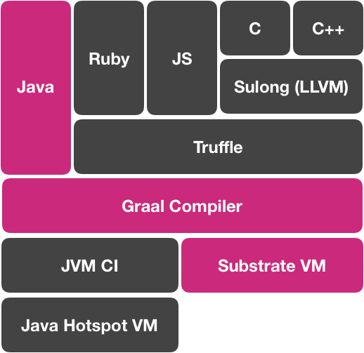
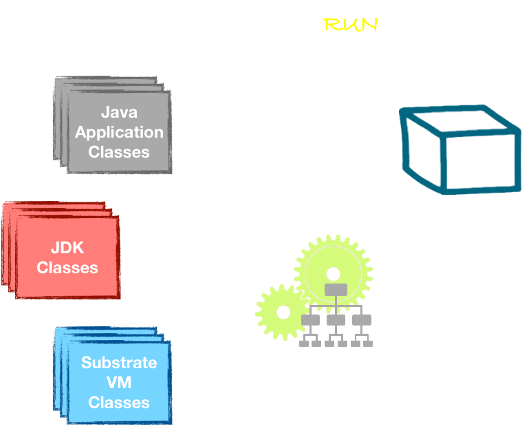

-@@-

### GraalVM

-@@-

### GraalVM

<!-- .element style="max-width: 60%" -->

Closed-world assumption

-@@-

### GraalVM *The dark side*<!-- .element class="fragment" -->

-@@-

### GraalVM *The dark side*

***Non supporté***

* Classloading dynamique - pas de classloader
* Invokedynamic
* finalizer *C'est mal, vous le saviez*<!-- .element class="fragment" style="color: crimson;" -->
* security manager

-@@-

### GraalVM *The dark side*

***Non supporté***

* Classloading dynamique - pas de classloader
* Invokedynamic<!-- .element style="color: black" -->
* finalizer C'est mal, vous le saviez<!-- .element style="color: black" -->
* security manager<!-- .element style="color: black" -->

-@@-

### GraalVM *The dark side*

***Supporté Mais avec des adaptations***

* Reflexion *Déclaration*<!-- .element style="color: black" -->
* Dynamic proxy *Déclaration*<!-- .element style="color: black" -->
* JNI
* Initialisation statique *warmup*<!-- .element style="color: black" -->
* Reference
  
-@@-

### GraalVM *The dark side*

***Supporté Mais avec des adaptations***

* Reflexion *Déclaration*<!-- .element style="color: crimson;" class="fragment" -->
* Dynamic proxy *Déclaration*<!-- .element style="color: crimson;" class="fragment" -->
* JNI<!-- .element style="color: black" -->
* Initialisation statique *warmup*<!-- .element style="color: crimson;" class="fragment" -->
* Reference<!-- .element style="color: black" -->

-@@-

-@@-

### Quarkus & GraalVM

1. Les fichiers de config
2. Le classpath **(annotation, getter, setter)**<!-- .element style="font-size: 65%" -->
3. Meta modele
4. Reflexion & proxy
5. *Start, I/O, threads*<!-- .element style="color: #e57125;" -->

