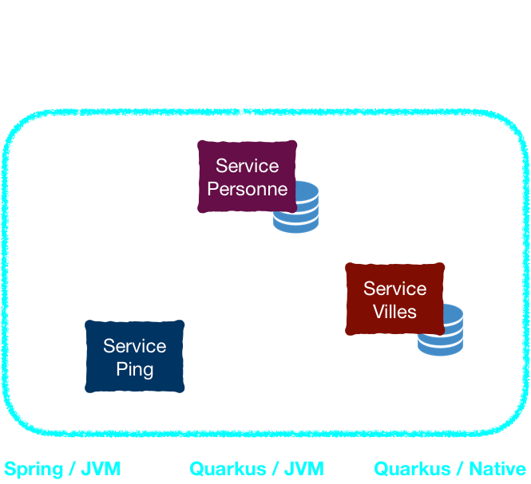
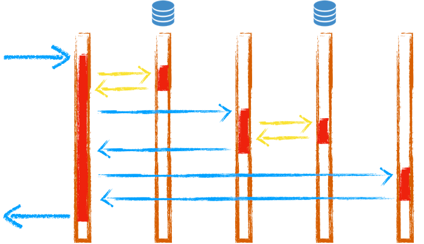

-@@-
<!-- .slide: data-background="images/goodbadugly.gif" data-background-size="110%" data-background-position="center center" -->

## Spring - JVM<!-- .element class="fragment" -->

-@@-
<!-- .slide: data-background="images/goodbadugly.gif" data-background-size="110%" data-background-position="center center" -->

## Quarkus - JVM

-@@-
<!-- .slide: data-background="images/goodbadugly.gif" data-background-size="110%" data-background-position="center center" -->

## Quarkus - natif

-@@-

### L'architecture

<!-- .element style="max-width:60%" -->

-@@-

### Les appels

-@@-

> Run them !<!-- .element style="font-size: 350%;" -->

