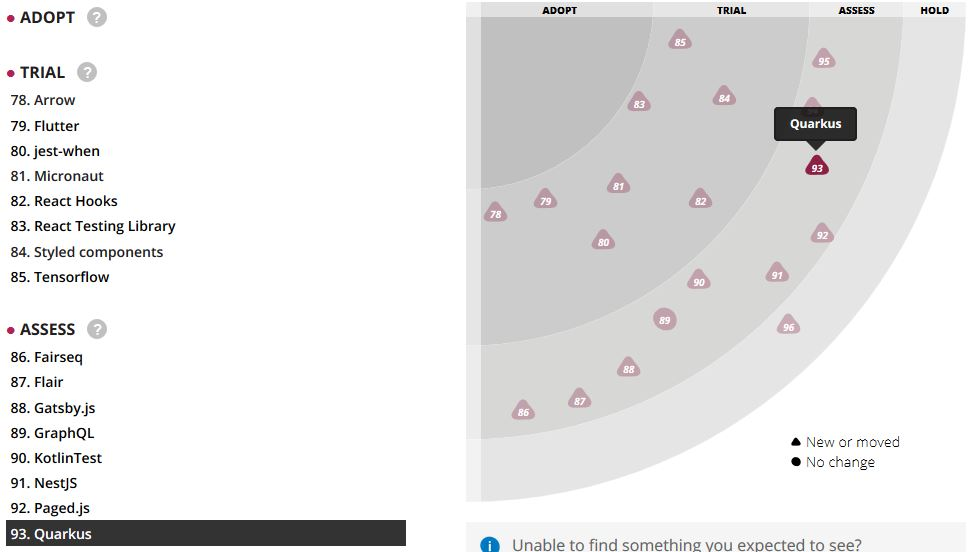
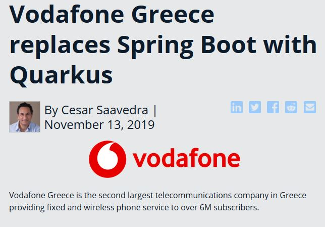
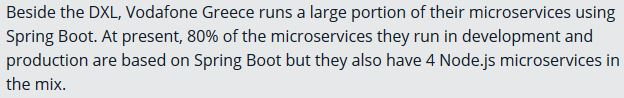
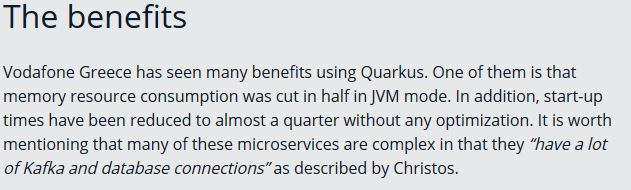

### Et maintenant ?

-@@- 

En résumé,

* Lancé en avril 2019
* 28/11/2019 : v1.0.0
* 3400 stars github
* Projet vivant
* Porté par redHat

 -@@-
 
 ### A évaluer

 
 <!-- .element style="max-width:60%" -->
 
**`www.thoughtworks.com/radar`**

 -@@-
 
 ### Déjà en prod !!!
 
 
 
 -@@-
 
 #### Vodafone & Quarkus
 
 
 
 
 
-@-
 
-@@-

*Maintenant vous connaissez le chemin*

<!-- .element style="max-width: 70%" -->

> L'appenterez vous ?