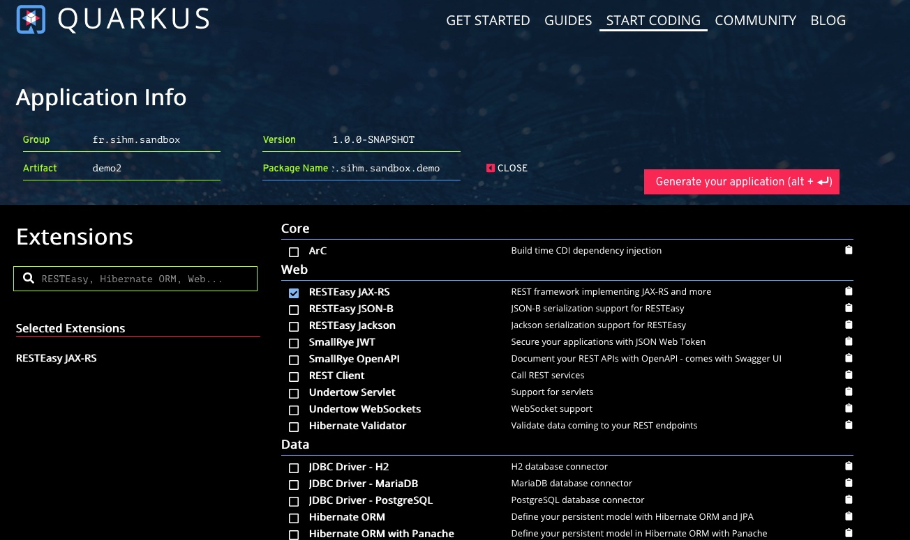

## Comment créer un projet ?

* Maven *via le plugin maven*<!-- .element class="fragment" -->
* code.quarkus.io *un starter !*<!-- .element class="fragment" -->

-@@-

### Maven

```maven
mvn io.quarkus:quarkus-maven-plugin:create
```

ou

```maven
mvn io.quarkus:quarkus-maven-plugin:create 
-DprojectGroupId=fr.sihm.sandbox 
-DprojectArtifactId=demo1 
-DclassName=HelloEndpoint -Dpath="/hello"
```

-@@-

### code.quarkus.io

La bonne idée de *Spring Initializr*

à la sauce quarkus

-@@-

### code.quarkus.io



-@@-

## Lancer l'application

```
mvn compile quarkus:dev
```

-@@-

## Le mode debug

```
mvn compile quarkus:dev -Ddebug
```

> ne lance l'appli que lorsqu'un debugger est connecté

-@@-

## le mode debug


connection en remote

-@@-

# demo
