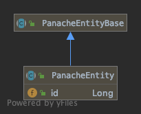

## Et les données

-@@-

## Hibernate

> Implementation JPA

-@@-

## Hibernate

La configuration...

... via application.properties

notes:

-@@-

## Hibernate

La configuration...

... via application.properties


notes:
Il n'y a pas de META-INF/persistence.xml, quarkus en analysant le fichier de properties identifie le(s) connexion DB
Mais pour des besoins avancés, il est possible de mettre en place ce fichier

-@@-

## Hibernate

*2 pattern possible*

* approche DAO (aka Repository dans un autre monde)<!-- .element class="fragment" -->
* Approche Active record (JPA with panache)<!-- .element class="fragment" -->

-@@-

## Hibernate / DAO

* entité
* DAO (accès au donnée)
* service (traitement métier)
* exposition

-@@-

## Hibernate avec Panache

> Là cela commence a devenir fun :)

**Les bonnes idées de Play**

**Et active record**

-@@-

## Hibernate avec Panache

```shell
./mvnw quarkus:add-extension
  -Dextensions="io.quarkus:quarkus-hibernate-orm-panache"
```

-@@-

## Hibernate avec Panache

```xml
<dependency>
    <groupId>io.quarkus</groupId>
    <artifactId>quarkus-hibernate-orm-panache</artifactId>
</dependency>
```

-@@-

## Active record

En génie logiciel, le patron de conception (design pattern) active record (enregistrement actif en français) est une approche pour lire les données d'une base de données. Les attributs d'une table ou d'une vue sont encapsulés dans une classe. Ainsi l'objet, instance de la classe, est lié à un tuple de la base. Après l'instanciation d'un objet, un nouveau tuple est ajouté à la base au moment de l'enregistrement. Chaque objet récupère ses données depuis la base ; quand un objet est mis à jour, le tuple auquel il est lié l'est aussi. La classe implémente des accesseurs pour chaque attribut. <!-- .element style="font-size: 60%;" -->

*- Wikipedia*<!-- .element style="color: #e57125; float: right" -->

-@@-

## Active record

## TL;DR

-@@-

## Active record

**L'entité porte les méthodes pour la manipuler**

-@@-

## Hibernate with *Panache*

Les entité herite de `PanacheEntity`



-@@-

## Hibernate with *Panache*


-@@-

## Hibernate with *Panache*

# Demo