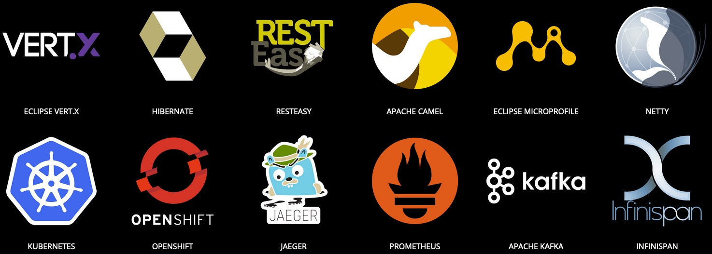

## Quarkus

***Tout le monde a 5 ans d'XP***

-@-

## Quarkus

> Les meilleures bibliothèques et normes

***MicroProfile, Hibernate***

***apache camel, RestEasy, Kafka***

***Vert.X, undertow***

-@-

## Quarkus

> Les meilleures bibliothèques et normes

-@-

## Microprofile

The MicroProfile is a baseline platform definition that optimizes Enterprise Java for a microservices architecture and delivers application portability across multiple MicroProfile runtimes.  

*- MicroProfile FAQ*<!-- .element style="color: #e57125; float: right" -->

notes:
MicroProfile is an open-source specification that brings a number of microservices-centric features to the Java EE ecosystem.

-@@-

## Microprofile

### 2016, la v1

**CDI, JSON-P, JAX-RS**

-@@-

## Microprofile

### 2019, la v3

**CDI, JSON-P, JSON-B, JAX-RS**

*Config, Health Check, Metrics, Fault Tolerance, JWT Propagation, Rest Client, Open API, OpenTracing*<!-- .element style="font-size: 80%;" -->

-@-

## Hibernate

***Implémentation JPA***
la plus connue

-@@-

## Hibernate

Avec panache ?

***Pardon ?***<!-- .element class="fragment" -->

-@@-

## Hibernate panache

Les bonne idées de Playframework

On verra cela pour la démo<!-- .element class="fragment" -->

-@-

## RestEasy

Implémentation JAX-RS

-@-

### le reste, a vous d'explorer
