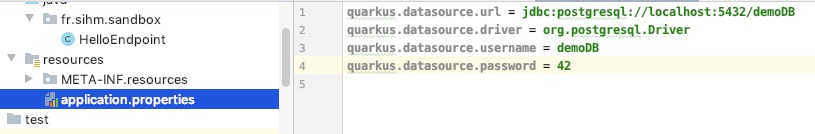

## Configuration

***`application.properties`***

-@@-
<!-- .slide: data-background="./images/what.gif"  data-background-size="60%" data-background-position="center center" -->
***`application.properties`***

-@@-

## Configuration

> microprofile version 1 +

-@@-

## Configuration

La configuration de l'application

> par exemple... <!-- .element class="fragment" -->

